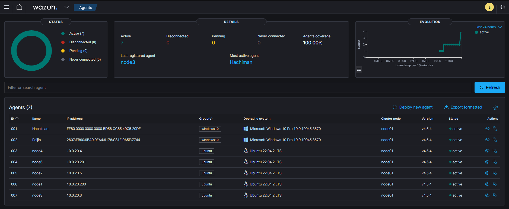
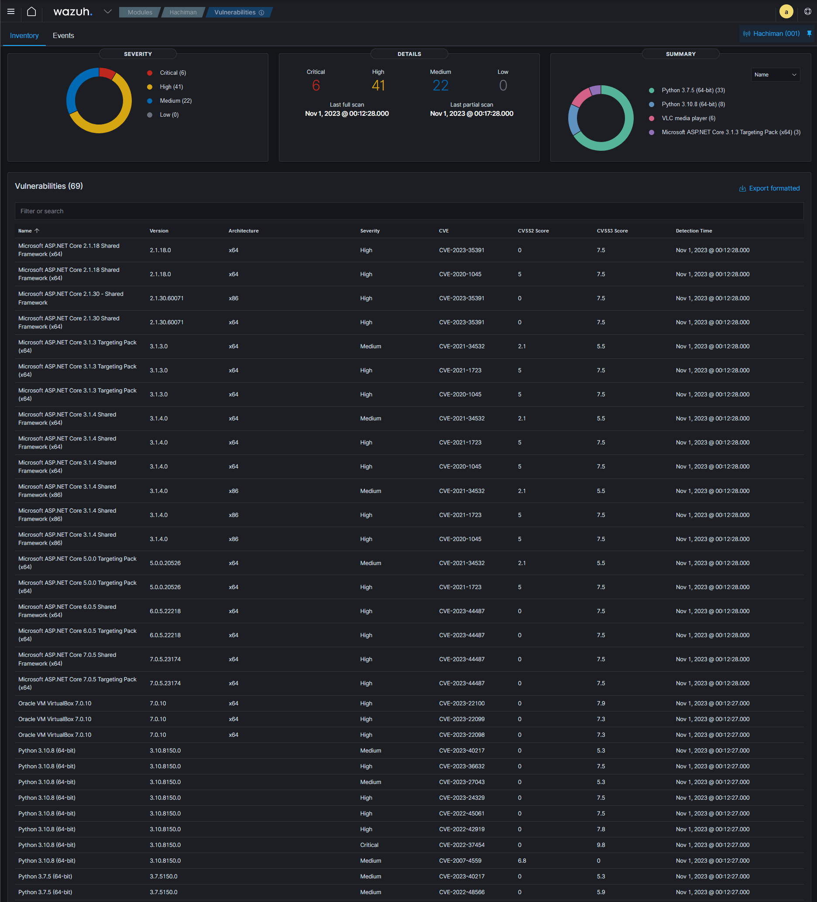
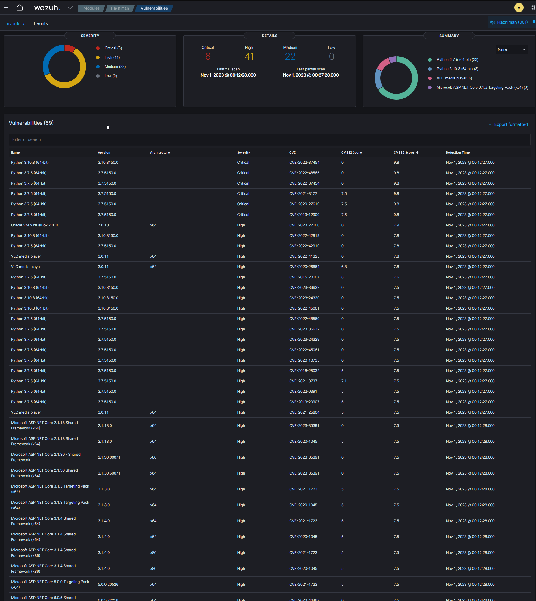
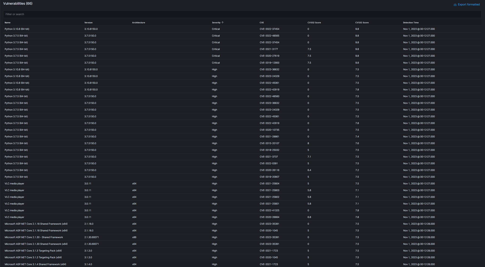
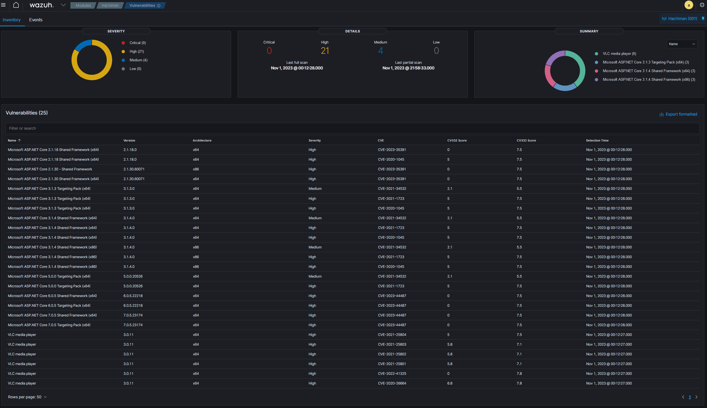
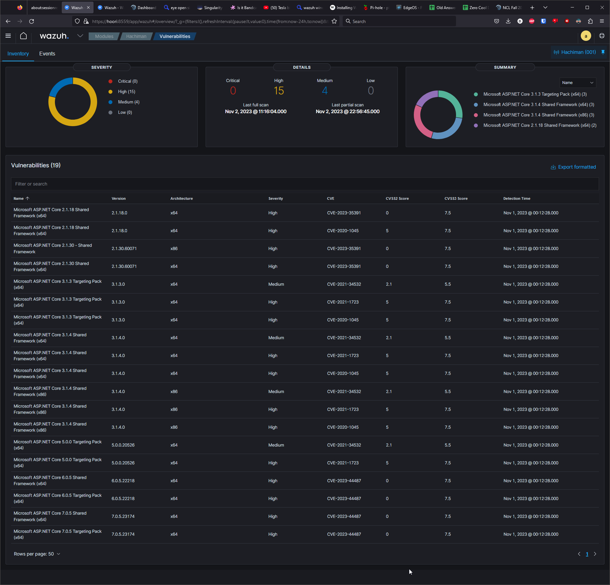

# wazuh

## Cast
|hostname | os | access | ip  |  |  |  | | | |
|-|-|-|-|-|-|-|-|-|-|
dell-r720xd-idrac | PowerEdge R720xd iDRAC | dell-r720xd-idrac | 192.168.2.40 | 2x Intel(R) Xeon(R) CPU E5-2680 0 @ 2.70GHz | 384.00 GB 24x DDR-3	16.00 GB Dual Rank 1333 MHz |2x WDC WDS500G2B0A 465.25 GBSSD  | 3x WDC WUH721414AL 13038.50 GB sata | 2x WDC WD140EFGX 68 13038.50 GB sata
PVE01 | ProxmoxVE 8.0.4 | https://pve01.bts4.com:8006 | 192.168.2.42 | bare metal on DELL-R720XD | mirrored on ssd
TRUENAS01 | TrueNAS-SCALE-22.12.3.3 | https://truenas01.bts4.com/ui/sharing | 192.168.2.60 | hosted on PVE01 | 5x 14tb hdd passthrough | 
hoori (potato)|  Ubuntu 22.04.2 LTS | hoori.bts4.com | 192.168.2.41 | Intel(R) Core(TM) i3-10100T CPU | 32gb ddr4 3200 | Samsung SSD 970 EVO Plus 1TB | maas controller | searxng
Hachiman | Windows 10 | hachiman.bts4.com | 192.168.2.43 | 2x Intel(R) Xeon(R) CPU E5-2687W 0 @ 3.10GHz | 8x8gb 1333 ddr3 


## Requirements
    

Agents | CPU  | RAM | Storage (90 days)
|-|-|-|-|
| 1–25 | 4 vCPU | 8 GiB |50 GB 
25–50 | 8 vCPU |8 GiB|100 GB
50–100|8 vCPU|8 GiB|200 GB
[wazuh Documentation](https://documentation.wazuh.com/current/quickstart.html)

Provision 8vCPU and 8GiB on pve01 as wazuh01 on debian create nfs 
Vs put it on the i3 potato

Let's put it on the potato hoori  
From the wazuh compatabality
Distribution | version 
|-|-|
Amazon Linux |2 
CentOS |7, 8 
Red Hat Enterprise Linux |7, 8, 9 
Ubuntu |16.04, 18.04, 20.04, 22.04

```
ddot@hoori:~/wazuh$ hostnamectl 
 Static hostname: hoori
       Icon name: computer-desktop
         Chassis: desktop
      Machine ID: 4b551753675a4c41a010261ebb158b52
         Boot ID: fd4e8ecebb6c4125ad81db20f9247a66
Operating System: Ubuntu 22.04.3 LTS              
          Kernel: Linux 5.15.0-87-generic
    Architecture: x86-64
 Hardware Vendor: Lenovo
  Hardware Model: ThinkCentre M70q
```
So were on a supported version 

To install
```sh
mkdir ~/wazuh
cd ~/wazuh
curl -sO https://packages.wazuh.com/4.5/wazuh-install.sh 
echo Install and configure Wazuh server, Wazuh indexer, Wazuh dashboard. and give it a unused port of 8559
sudo bash ./wazuh-install.sh --all-in-one -p 8559
```

Next Configure the Wazuh with the web interface at https://hoori:8559  
access with username: admin and password: bWxnIGdzdiBremhoZGxpdyB5ZmcgcmcgZHpoIHogdGxsdyBnaWI=

Lets go and unblind ourselves an enable dark mode by going to Management --> Stack Management --> Advanced Settings --> Search For Dark Mode --> enable --> save changes --> reload page

now lets configure wazuh to gather defender events

wazuh dropdown --> Management --> Administration --> Groups

Lets add a group for windows deskop ```Add New Group``` --> ```WindowsDestop``` --> ```Save new Grou```

Now lets add the log colection configuration

Click the pencil for WindowsDesktop in the actions colume   
Add 
```xml
<localfile>
  <location>Microsoft-Windows-Windows Defender/Operational</location>
  <log_format>eventchannel</log_format>
</localfile>
```


Lets install the agent 
Click Add agents a fill out the form
Lets start with windows
from admin powershell run 
```ps1
Invoke-WebRequest -Uri https://packages.wazuh.com/4.x/windows/wazuh-agent-4.5.4-1.msi -OutFile ${env:tmp}\wazuh-agent.msi; msiexec.exe /i ${env:tmp}\wazuh-agent.msi /q WAZUH_MANAGER='hoori' WAZUH_REGISTRATION_SERVER='hoori' WAZUH_AGENT_GROUP='windows10' 

net start wazuh
```


Lets test it
on the windows box
```ps1
'X5O!P%@AP[4\PZX54(P^)7CC)7}$EICAR-STANDARD-ANTIVIRUS-TEST-FILE!$H+H*' | Out-File ~/elcar.txt 
```

For my ubuntu configu

```sh
curl -so wazuh-agent.deb https://packages.wazuh.com/4.x/apt/pool/main/w/wazuh-agent/wazuh-agent_4.5.4-1_amd64.deb && sudo WAZUH_MANAGER='10.0.20.1' WAZUH_AGENT_GROUP='ubuntu' dpkg -i ./wazuh-agent.deb
echo enable and start wazuh agent service
sudo systemctl daemon-reload
sudo systemctl enable wazuh-agent
sudo systemctl start wazuh-agent
```

lets deploy to the other potatoes which is our k3s cluster

10.0.20.3
10.0.20.4
10.0.20.5
10.0.20.200
10.0.20.201

ssh ip 'bash -s' < ubuntu_wazuh_agent.sh 

```sh
Selecting previously unselected package wazuh-agent.
(Reading database ... 109199 files and directories currently installed.)
Preparing to unpack ./wazuh-agent.deb ...
Unpacking wazuh-agent (4.5.4-1) ...
Setting up wazuh-agent (4.5.4-1) ...
enable and start wazuh agent service
Synchronizing state of wazuh-agent.service with SysV service script with /lib/systemd/systemd-sysv-install.
Executing: /lib/systemd/systemd-sysv-install enable wazuh-agent
Created symlink /etc/systemd/system/multi-user.target.wants/wazuh-agent.service → /lib/systemd/system/wazuh-agent.service.
```



now lets enable the vulnerability-detector

go to Management --> Configuration --> Edit Configuration --> search for vulnerability-detector --> change <enabled>no</enabled> to <enabled>yes</enabled> --> save --> restart manager

Let it cook for a bit and from home lets check Vulnerabilities --> select agent --> Hachiman #windows10



Sort by CVSS3 score and python is the winner as biggest threat.


6 critical and 5 of them are the same package. Guess i need to do better keeping my python up to date

i'm running chocolaty for windows package managment so I'll run a choco upgrade all -y and after that



so chocolaty resolved 3  
lest resolve the rest

opening apps & features shows they are install and choco list shows it's not managing them. Need to do better at using a package manager

after uninstalling old python packages were down to 25 and none are critical


and now vlc is managed by choco



As far as the linux boxes go, they aren't showing as having any vulnerabilities. I have no idea if this is a error or that my systems are up to date and correctly patched.

## Takeaway

Wazuh looks to have a lot of capabilities but isn't set up with a lot of defaults. Theres a bunch of configuration to be done and the menues aren't that well layed out. I'll need to spend more time researching how to configure wazuh for my needs.

Having the current vulnerabilities listed was useful on windows as common AV and defender doesn't provide info that apps are out of date and need updated. Being able to get that info was helpful as it allowed me to find what programs weren't installed through my package manager.